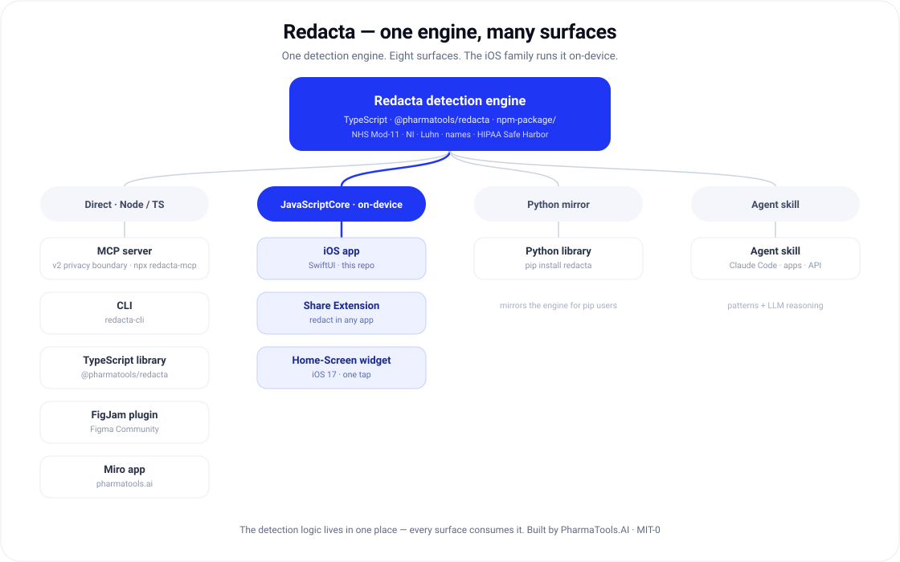
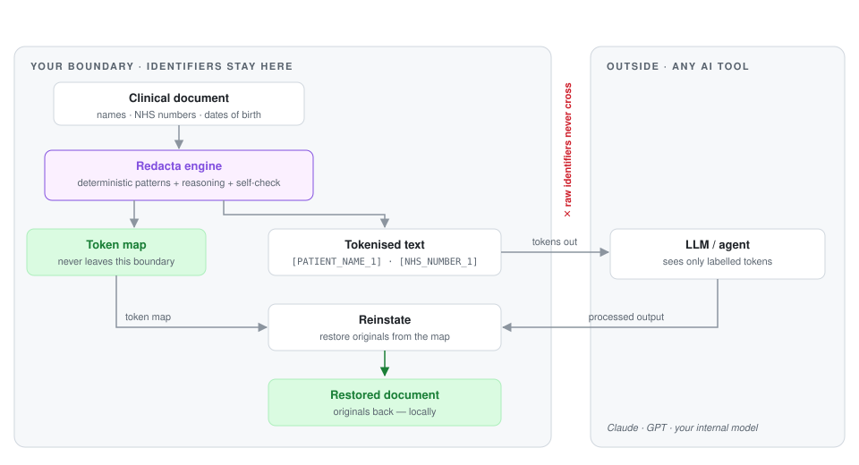

# Redacta

[](https://github.com/nickjlamb/redacta/actions/workflows/ci.yaml)
[](https://doi.org/10.5281/zenodo.21115605)
[](https://www.npmjs.com/package/@pharmatools/redacta)
[](https://www.npmjs.com/package/@pharmatools/redacta)
[](https://www.npmjs.com/package/redacta-mcp)
[](https://pypi.org/project/redacta/)
[](https://apps.apple.com/app/redacta-redact-for-ai/id6784591850)
[](https://claude.ai/directory/connectors/ant.dir.gh.nickjlamb.redacta)
[](gateway-service/k8s/README.md)

Pseudonymise medical and clinical documents before they're processed by AI or
shared. Redacta replaces patient identifiers with labelled tokens —
`[PATIENT_NAME_1]`, `[NHS_NUMBER_1]`, `[DATE_OF_BIRTH_1]`, … — while leaving the
clinical meaning intact, and returns a redaction report alongside the cleaned
text.

It started as an [Agent Skill](https://agentskills.io) and is now one engine
shipped across nine surfaces — an iOS app, agent skill, MCP server, a
self-hosted HTTP service with a Kubernetes deployment, two libraries, a CLI,
and two whiteboard apps.

## One engine, many surfaces

<p align="center">
  
</p>

| Surface | Folder | Get it |
|---------|--------|--------|
| iOS app — iPhone (app, Share Extension, widget) | [`ios-app/`](ios-app/) | Build with Xcode — see [`ios-app/README.md`](ios-app/README.md) |
| Agent skill (Claude Code / apps / API) | `SKILL.md`, `scripts/` | `openclaw skills install redacta` ([ClawHub](https://clawhub.ai/nickjlamb/redacta)) |
| MCP server (Claude Desktop, Cursor, …) | `mcp-server/` | `npx -y redacta-mcp` ([npm](https://www.npmjs.com/package/redacta-mcp) · [MCP Registry](https://registry.modelcontextprotocol.io) · [Anthropic MCP Directory](https://claude.ai/directory/connectors/ant.dir.gh.nickjlamb.redacta)) |
| TypeScript library | `npm-package/` | `npm i @pharmatools/redacta` ([npm](https://www.npmjs.com/package/@pharmatools/redacta)) |
| Python library | `python-package/` | `pip install redacta` ([PyPI](https://pypi.org/project/redacta/)) |
| Command-line tool | `cli-package/` | `npx redacta-cli` ([npm](https://www.npmjs.com/package/redacta-cli)) |
| Self-hosted HTTP service + Kubernetes | [`gateway-service/`](gateway-service/) | `docker build` — see [`gateway-service/README.md`](gateway-service/README.md) |
| Miro app | `miro-app/` | [getpatiently.ai → Redacta](https://www.pharmatools.ai/redacta) |
| FigJam plugin | `figjam-plugin/` | [Figma Community](https://www.figma.com/community/plugin/1647311189828426124) |

The detection logic lives in one place — the TypeScript engine
(`@pharmatools/redacta`, in `npm-package/`), which the MCP server and both
whiteboard apps consume, and which the iOS app runs on-device via JavaScriptCore.
The Python package mirrors it for `pip` users; the agent skill adds LLM reasoning
for free-text names on top of the deterministic patterns.

## How it works

<picture>
  <source media="(prefers-color-scheme: dark)" srcset="docs/boundary-dark.svg">
  
</picture>

Two layers:

- **Patterns (deterministic).** A bundled script (`scripts/redact_structured.py`,
  Python standard library only, no network) matches fixed-format identifiers:
  NHS numbers (Modulus-11 validated), UK National Insurance numbers, dates of
  birth, UK postcodes, phone numbers, emails, and hospital/MRN numbers. US SSN
  and ZIP codes are also handled.
- **Reasoning (judgement).** The skill then has the agent handle what patterns
  can't: patient names (told apart from the clinicians treating them), relatives
  and carers, postal addresses, and identifying ages.
- **Self-check.** A final pass re-reads the output for any identifier that slipped
  through before the report is written.

It also works in reverse. **Re-identification** (`scripts/reinstate.py`) takes the
token map from an earlier redaction and restores the original values — so you can
redact a document, run it through another AI tool, and put the real details back
locally. Redact → process → re-identify is a complete round trip, and identifiers
only ever exist on your machine.

**Safe Harbor mode.** Ask for HIPAA Safe Harbor (or "US de-identification") and
Redacta applies a stricter pass: *all* dates (not just the date of birth), all
specific ages, and the remaining HIPAA identifiers — fax, certificate/licence,
device serial, VIN, and health-plan beneficiary numbers.

## Self-hosting on Kubernetes

Organisations that can't let identifiable text leave their environment can
run Redacta inside their own infrastructure: a small HTTP service
([`gateway-service/`](gateway-service/)) deployable into an existing
Kubernetes cluster with plain YAML — two stateless replicas behind a
Service for redact/reinstate, an optional single-replica session boundary
for the protect → release loop, health probes, resource limits, restrictive
security defaults, and no-PHI logging. Text is pseudonymised before it
reaches any external AI service, and the processing boundary stays under
your control. Walkthrough (local `kind` cluster included):
[`gateway-service/k8s/README.md`](gateway-service/k8s/README.md) ·
concepts: [`docs/KUBERNETES.md`](docs/KUBERNETES.md).

## Install

**Claude Code**

```bash
git clone https://github.com/nickjlamb/redacta ~/.claude/skills/redacta
```

Then invoke it with `/redacta`, or let it trigger automatically when you ask to
redact or de-identify clinical text.

**Claude apps / API**

Zip the repository folder and upload it as a skill.

## Contents

| Path | What it is |
|------|------------|
| `SKILL.md` | The skill — instructions plus metadata |
| `reference.md` | Pattern specs, the Modulus-11 algorithm, NI prefix rules, the date-of-birth vs clinical-date rule, token vocabulary, limitations |
| `scripts/redact_structured.py` | The deterministic pattern layer |
| `scripts/reinstate.py` | The re-identification layer (restore originals from a token map) |
| `scripts/test_redact_structured.py` | Tests for the pattern layer |
| `scripts/test_reinstate.py` | Tests for the re-identification layer |
| `evaluations.json` | Example evaluation scenarios |

Run the tests:

```bash
python3 scripts/test_redact_structured.py
python3 scripts/test_reinstate.py
```

## A note on limits

Redacta is a strong first line of defence, not a guarantee. It won't catch every
possible identifier and isn't a substitute for formal data-protection processes.
Always review the redaction report before sharing text.

## License

[MIT-0](LICENSE) (MIT No Attribution). Built by
[PharmaTools.AI](https://www.pharmatools.ai/redacta).
