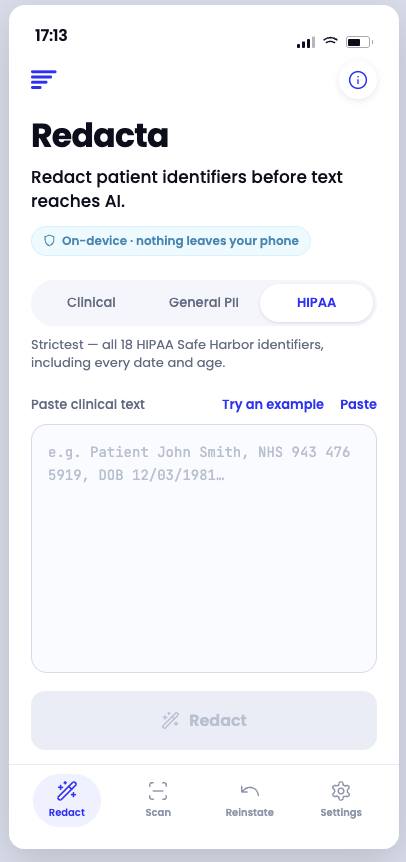
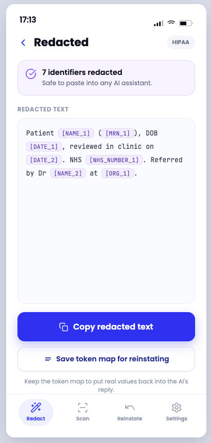
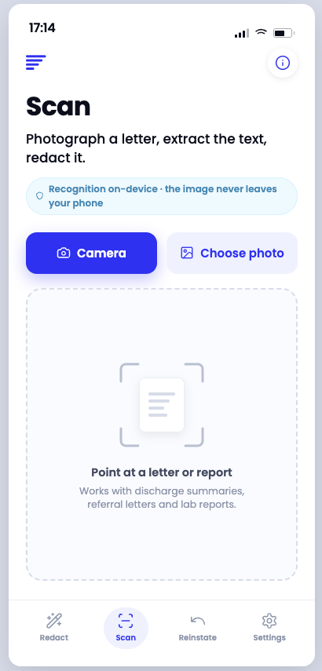
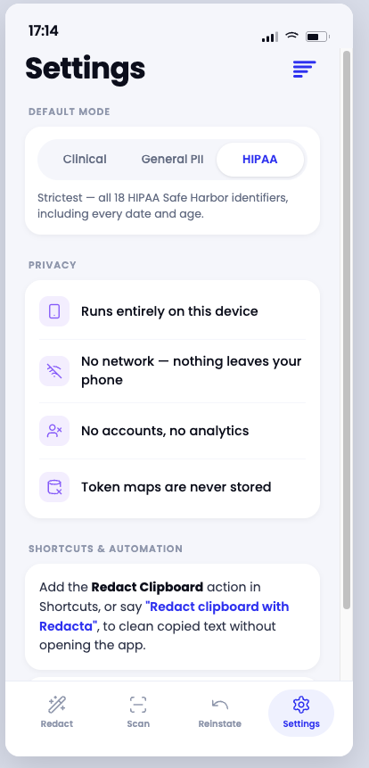

# Redacta for iOS

**Redact patient identifiers before text ever reaches an AI — entirely on your iPhone.**

Clinicians and medical writers increasingly paste notes into ChatGPT and Claude.
Redacta makes the safe version one tap away: it replaces names, NHS numbers, dates,
record IDs and other identifiers with neutral tokens like `[NAME_1]` — on-device, with
no network, no accounts, and nothing stored. The tokens can be reversed afterwards to
put real values back into the AI's reply.

A native SwiftUI app, a Share Extension, and a Home-Screen widget — all driving the
**same** redaction engine that powers the Redacta Claude skill, MCP server, CLI and
FigJam/Miro plugins.

<p align="center">
  
  
  
  
</p>

> Screens shown are the PharmaTools.AI "Direction A" design the app implements.

---

## One engine, many surfaces

The redaction logic is a single deterministic **TypeScript engine** (`../npm-package`):
NHS Modulus-11 and NI/Luhn validation, keyword-anchored name detection (patients and
relatives redacted, clinicians preserved), and HIPAA Safe Harbor passes. iOS does **not**
reimplement any of it — the engine is compiled to a 15 KB dependency-free IIFE and run
through **JavaScriptCore**, so every surface stays in lockstep with one source of truth.

```
                       ┌──────────────────────────┐
                       │  TypeScript redaction     │
                       │  engine  (npm-package)    │
                       └─────────────┬─────────────┘
              esbuild → redacta.bundle.js (IIFE, no deps)
                                     │  JavaScriptCore
        ┌─────────────┬─────────────┼─────────────┬─────────────┐
     iOS app    Share Extension   Widget       (also: skill, MCP,
   (this dir)   (redact in place) (clipboard)   CLI, FigJam/Miro)
```

## Highlights

- **Three modes** — Clinical, General PII, and HIPAA Safe Harbor, with NHS-number
  checksum validation and a self-check that flags possible leftovers.
- **The reveal** — redacted text renders with the identifiers replaced by tinted token
  pills (a custom `Layout` flow), so the redaction is legible at a glance.
- **Reinstate (stateless round-trip)** — paste the AI's reply plus the token map and the
  real values are restored. Maps live in memory for the session only and are never
  written to disk — no competitor offers this without storing state.
- **Redact anywhere** — a Share Extension redacts selected text from Mail, Safari, Notes
  and more; a Shortcut and an interactive Home-Screen **widget** clean the clipboard in
  one tap.
- **Scan** — photograph a letter; on-device Apple Vision OCR extracts the text, then
  redacts it. The image never leaves the device.
- **On-device by design** — no network entitlement, no accounts, no analytics, no
  persistence → a truthful "Data Not Collected" privacy label.
- **A real design system** — `RedactaApp/Brand/` is a from-scratch implementation of the
  PharmaTools.AI brand: color tokens with **light/dark** variants, Poppins + JetBrains
  Mono with **Dynamic Type** scaling, a custom tab bar, segmented control, buttons and
  brandmark, plus accessibility traits, haptics, and a branded launch screen.

## Architecture

```
ios-app/
├── project.yml                     XcodeGen spec → Redacta.xcodeproj (3 targets)
├── RedactaEngine/                  Shared engine (app + extension + widget)
│   ├── entry.mjs · build-bundle.mjs    esbuild → IIFE bundle
│   ├── Resources/redacta.bundle.js     bundled engine (15 KB, no deps)
│   ├── RedactaEngine.swift             JavaScriptCore wrapper → typed Swift API
│   ├── RedactionResult.swift           result / error types
│   └── SharedSettings.swift            App Group prefs (mode, appearance)
├── RedactaApp/
│   ├── RootView.swift                  custom tab bar + state-preserving shell
│   ├── RedactScreen / RedactResultScreen
│   ├── ScanScreen.swift · OCRService.swift · CameraPicker.swift
│   ├── ReinstateScreen.swift · Session.swift   in-memory token map (never stored)
│   ├── SettingsScreen.swift · WelcomeView.swift · InfoView.swift
│   ├── RedactaAppIntents.swift          Shortcuts: Redact Text / Redact Clipboard
│   ├── Brand/                           the design system (tokens, components, fonts)
│   └── Fonts/                           Poppins + JetBrains Mono
├── RedactaShareExtension/          Share Sheet → redact (brand UI, reuses engine)
└── RedactaWidget/                  iOS 17 interactive widget (reuses the App Intent)
```

### Decisions worth calling out

- **Engine reuse over reimplementation.** Bundling the TS engine via JavaScriptCore kept
  detection logic identical across seven surfaces and made the iOS build a few weekends
  rather than a rewrite.
- **Privacy as a hard constraint, not a feature.** There is no networking code anywhere;
  the constraint shaped the UX (copy-then-paste, in-memory token maps) and unlocked the
  strongest possible App Store privacy posture.
- **Adaptive design tokens.** Colors are `Color(light:dark:)` dynamic providers and a
  single shared `AppearanceStore`, so the light/dark toggle flips the whole app and the
  extension instantly.
- **The widget reuses the App Intent.** `RedactClipboardIntent` powers both the Shortcut
  and the iOS-17 `Button(intent:)` widget; a `REDACTA_WIDGET` flag keeps the app's
  `AppShortcutsProvider` out of the widget target.

## Build & run

```bash
brew install xcodegen          # one-time
cd ios-app
xcodegen generate
open Redacta.xcodeproj
```

Select the **RedactaApp** scheme and run on an iPhone simulator or device. For a device
build, set your team in Signing & Capabilities (the App Group
`group.com.medcopywriter.redacta` is declared on all targets). The widget needs iOS 17;
the app targets iOS 16.

## Rebuilding the engine bundle

`Resources/redacta.bundle.js` is generated from the shared TS engine:

```bash
npm --prefix npm-package run build        # tsc → dist/
node ios-app/RedactaEngine/build-bundle.mjs
```

It emits a single ES2018 IIFE that assigns `globalThis.Redacta`
(`redact`, `reinstate`, `selfCheck`, `isValidNhs/Ni/Luhn`) — no module system, no
Node/DOM globals — so it loads cleanly into a `JSContext`. Verify it independently:

```bash
node -e 'const fs=require("fs"),vm=require("vm");const c={};vm.createContext(c);
vm.runInContext(fs.readFileSync("ios-app/RedactaEngine/Resources/redacta.bundle.js","utf8"),c);
console.log(c.Redacta.redact("Patient John Smith, NHS 943 476 5919","clinical").text)'
```

## Launch prep

- `AppStore-Privacy.md` — the "Data Not Collected" nutrition-label guide.
- `AppStore-Listing.md` — name, subtitle, keywords, description (within Apple's limits).
- `AppStore-Screenshots.md` — the 6.9" screenshot plan and captions.
- `PrivacyInfo.xcprivacy` — privacy manifest (no tracking, no collection, UserDefaults
  reasons), bundled in all three targets.

## Roadmap

- **iPad / Mac Catalyst** — currently iPhone-only (`TARGETED_DEVICE_FAMILY: "1"`). The
  strongest case is Split View / desktop: "redact here, paste into the AI next to it."
- **OCR polish, Lock-Screen widget, Spotlight indexing.**
