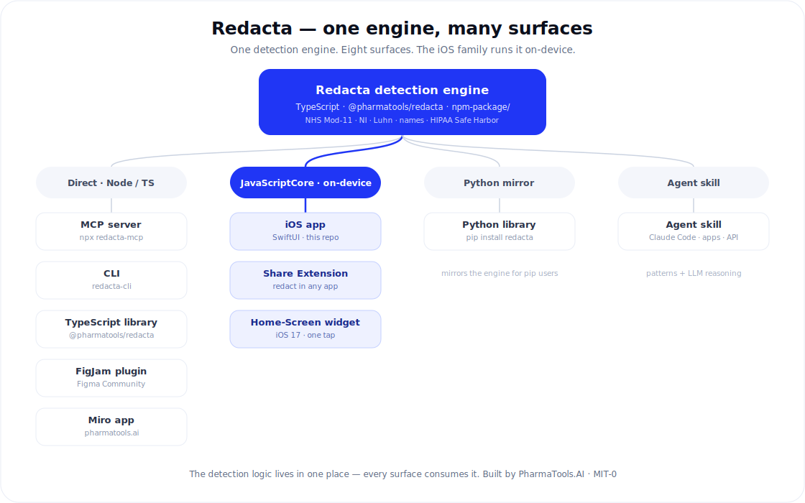

# Redacta — Case Study

> What started as one open-source AI skill is now a single redaction engine shipped
> across **eight surfaces** — culminating in a polished, submission-ready native **iOS
> app**. Redacta replaces patient identifiers with labelled tokens so clinical text can
> be used with AI safely, with the clinical meaning intact.

**Role:** Sole creator — concept, architecture, implementation, design, and release across every surface.
**Built as:** an Agent Skill (the origin) · MCP server (in Anthropic's MCP Directory) · TypeScript & Python libraries · CLI · FigJam/Miro plugins · native iOS app (app + Share Extension + widget).
**Stack:** TypeScript engine · Swift / SwiftUI + JavaScriptCore (iOS) · Python · MIT-0 · open source.

## The problem

Clinicians, researchers and medical writers routinely paste real clinical text —
letters, discharge summaries, referrals — into AI tools to summarise or rewrite
it. That text is dense with patient identifiers: names, NHS numbers, dates of
birth, addresses. Redacting by hand is slow and error-prone, and a single missed
identifier defeats the purpose.

## What I built

A two-layer redaction skill that strips identifiers *before* the text reaches any
downstream AI:

- **Patterns (deterministic).** Fixed-format identifiers matched exactly — NHS
  numbers validated with the Modulus-11 checksum (so a phone number is never
  mistaken for one), UK National Insurance numbers with HMRC prefix rules, UK
  postcodes, phones, emails and hospital/MRN numbers.
- **Reasoning (judgement).** What patterns can't catch — patient names
  (distinguished from the clinicians treating them), postal addresses, identifying
  ages — handled by agent reasoning, erring toward redaction when uncertain.

Output: a pseudonymised document with clinical content untouched, plus a report of
every identifier replaced.

## Decisions that show the thinking

- **DOB vs clinical date** — a date of birth is removed, but an appointment date is
  kept; blanket date-stripping would destroy the meaning Redacta exists to
  preserve.
- **Patient vs clinician** — pseudonymisation protects the data subject, so the
  patient is redacted while the treating clinician and institution are kept by
  default (with a full-de-identification option).
- **Honest about limits** — positioned explicitly as a strong first line of
  defence, *not* a guarantee or a substitute for formal data-protection review.
  Accuracy over hype.

## From one skill to one engine, many surfaces

Rather than reimplement detection for every new platform, I extracted the logic into a
single deterministic **TypeScript engine** and made every surface consume the *same*
code. Redacta now ships eight ways — the Agent Skill, an MCP server (listed in
Anthropic's MCP Directory), TypeScript and Python libraries, a CLI, FigJam and Miro
plugins, and a native iOS app. One source of truth means a change to NHS-number
validation lands everywhere at once instead of in five drifting copies.

  

## Redacta for iOS — the flagship surface

A native **SwiftUI** app, a **Share Extension**, and a Home-Screen **widget** — all
running the shared engine **on-device**. A clinician pastes a note (or photographs a
letter), redacts it, and copies the safe version into ChatGPT or Claude; afterwards
they can reverse the tokens to put real values back into the AI's reply.

**Engineering highlights**

- **Engine reuse, not rewrite.** The TypeScript engine is bundled to a 15 KB
  dependency-free IIFE and run through **JavaScriptCore**, so iOS shares one source of
  truth rather than a second implementation that would inevitably drift.
- **On-device by construction.** No networking code anywhere → a truthful "Data Not
  Collected" App Store privacy label. Token maps live in memory only and are never
  written to disk — a **stateless re-identification** round-trip no competitor offers.
- **On-device OCR.** Photograph a letter; Apple's Vision framework extracts the text
  locally before redaction — the image never leaves the phone.
- **A design system from scratch.** Implemented the PharmaTools brand in SwiftUI: color
  tokens with light/dark variants, Poppins + JetBrains Mono with Dynamic Type scaling, a
  custom tab bar and component set, accessibility traits, haptics, and a branded launch
  screen.
- **Reuse across targets.** The interactive iOS-17 widget and the Siri Shortcut share a
  single App Intent; the Share Extension reuses the same brand kit and engine.

**Decisions that show the thinking**

- **Privacy as a hard constraint, not a feature.** "Nothing leaves the device" shaped
  the UX (copy-then-paste, in-memory maps) and unlocked the strongest possible privacy
  posture — the constraint *became* the product.
- **Stateless reinstate.** Re-identification is genuinely useful, but persisting token
  maps would raise backup, export and security questions; keeping them in-session keeps
  the round-trip without the liability.
- **Shipped the unglamorous 20%.** Beyond features: accessibility, dark mode, a privacy
  manifest, the App Store privacy label, listing copy and a screenshot plan, plus updated
  Privacy Policy and Terms — the work that separates a demo from something submittable.

## Impact

- One engine, **eight surfaces**; the MCP server is listed in **Anthropic's MCP Directory**.
- The native **iOS app is feature-complete and submission-ready** — privacy nutrition
  label + manifest, listing copy/keywords, and a screenshot plan all prepared.
- 800+ installs on ClawHub (v1.0.0, MIT-0).
- Runs in Claude Code, the Claude apps, and the Claude API; published open-source
  on GitHub.
- The same on-device redaction approach also ships in Patiently AI, a live
  medical-text simplifier I build — so the technique is proven in production, not
  just as a demo.

## Skills demonstrated

Medical domain knowledge (NHS/clinical data formats, data-protection awareness) ·
AI/agent engineering (hybrid code-plus-reasoning design on an emerging open
standard) · Python (validation algorithms, regex, tested) · **native iOS — Swift /
SwiftUI, JavaScriptCore, Vision OCR, App Intents, WidgetKit, a from-scratch design
system, accessibility and dark mode** · platform architecture (one engine, many
surfaces) · App Store release readiness (privacy manifest, nutrition label, listing) ·
product positioning and technical writing.

## Links

- GitHub — https://github.com/nickjlamb/redacta
- Website — https://www.pharmatools.ai/redacta
- ClawHub — https://clawhub.ai/nickjlamb/redacta

---

## Short variants (for reuse across channels)

**One-liner (portfolio grid / header)**

Redacta — an open-source AI skill that pseudonymises medical documents before AI
processing. Two-layer design (checksum-validated patterns + agent reasoning),
MIT-0, 800+ installs.

**LinkedIn / profile blurb**

I built Redacta, an open-source Agent Skill that pseudonymises medical documents
so clinical text can be processed by AI without exposing the patient. It pairs
deterministic pattern-matching (NHS numbers validated by Modulus-11 checksum, UK
National Insurance numbers, postcodes) with agent reasoning for the things regex
can't reliably catch — names, addresses and ages. 800+ installs; open-sourced
under MIT-0.

**CV bullet (skill)**

Designed and shipped **Redacta**, an open-source (MIT-0) AI skill for
medical-document pseudonymisation — checksum-validated identifier detection +
agent reasoning; 800+ installs; runs across Claude Code, apps and API.

**CV bullet (platform / iOS)**

Grew **Redacta** from a single skill into one redaction engine shipped across eight
surfaces, including a submission-ready native **iOS app** (SwiftUI, on-device via
JavaScriptCore, Vision OCR, Share Extension, WidgetKit) with a from-scratch design
system, dark mode, accessibility, and full App Store privacy/launch prep.

**LinkedIn / profile blurb (iOS)**

I took Redacta from an open-source AI skill to a native iOS app — the same TypeScript
redaction engine running entirely **on-device** via JavaScriptCore, wrapped in a SwiftUI
app with a Share Extension, an interactive widget, on-device OCR, and a reversible
"reinstate" round trip that never stores patient data. Built the PharmaTools design
system from scratch (light/dark, Dynamic Type, accessibility) and prepared the full App
Store release: privacy manifest, "Data Not Collected" label, listing and screenshots.

**Skills / tech tags**

Agent Skills · Python · TypeScript · Swift / SwiftUI · JavaScriptCore · Vision OCR ·
App Intents · WidgetKit · MCP · Clinical NLP / de-identification · NHS & UK data
formats · design systems · accessibility · data-protection-aware product design ·
App Store release
